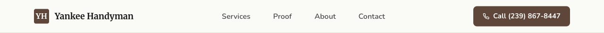
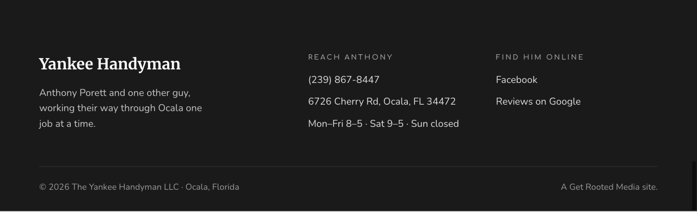
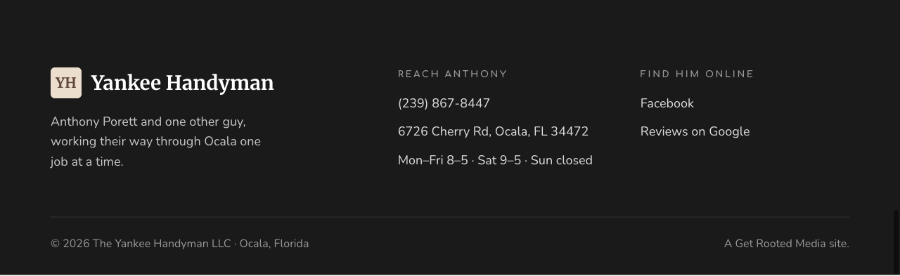

# Yankee Handyman — Build Audit

**Date:** 2026-05-03
**Live preview:** [yankee-handyman-preview-q49slana2-ron-7323s-projects.vercel.app](https://yankee-handyman-preview-q49slana2-ron-7323s-projects.vercel.app)
**Repo:** [github.com/ron841/grm-prospect-yankee-handyman](https://github.com/ron841/grm-prospect-yankee-handyman) (public)

> Read-this-first doc. Detailed findings split out into [photo-audit.md](photo-audit.md), [hero-evaluation.md](hero-evaluation.md), [comp-diff.md](comp-diff.md), [open-decisions-status.md](open-decisions-status.md). Screenshots in [screenshots/](screenshots/), FB-found photos in [fb-photos/](fb-photos/), footer YH mockup in [mockups/](mockups/).

---

## Build status

**What works.** Site is live, publicly accessible, sub-7MB total. All sections from `slots.md` render at all three breakpoints. Copy is verbatim from `content-inventory.md`. JSON-LD LocalBusiness schema valid. Static Forms backend wired correctly with the GRM key. Logo color extraction (k-means) returned a sepia/brown palette that swapped out the provisional navy/red — the build correctly inherits the swap. Three `pending-walkthrough` HTML comments are in place at every $125 reference.

**What doesn't.** The hero photo and pool-deck photo are both weak — hero shows Anthony mid-cement-board-install with awkward composition (text overlay covers him); the "Pool decks built like furniture" section ships a wood-frame mid-construction shot, not a finished pool deck. Photo grid has 4 generic "Completed work, 2025" captions because subjects weren't tagged. Tablet at 768px hits mobile mode (CSS rule is `max-width: 768px` inclusive) — only 1024px+ shows the tablet 2-col layout.

---

## Ron's two specific items

### 1. YH symbol in hero (current state)

The "YH symbol" is in the **nav header** sitting above the hero, not in the hero body itself. It's a 32×32px square with `--c-brand` (#5f463b warm brown) background, white serif "YH" text, sitting next to the "Yankee Handyman" wordmark.

Verdict: works fine as a logomark substitute. Small but readable. Brown-on-cream gives the "warm carpentry" register the site is going for.

### 2. YH symbol in footer (mockup)

**Implemented as a draft mockup at [`mockups/footer-yh-mockup.html`](mockups/footer-yh-mockup.html).** Not pushed to live preview per Ron's instruction — kept as a candidate change for Design's review.

The mockup adds a 44×44px box (slightly larger than nav's 32px to read at footer scale) with **reversed colors**: cream background (`#ebdecd` — picked from the same logo extraction that surfaced this hue at 23% of pixels), dark brown serif "YH" text. Sits next to the "Yankee Handyman" wordmark in the brand col.

| Before (current live) | After (mockup) |
|---|---|
|  |  |

Verdict: works visually. Cream-on-dark mirrors the nav's brown-on-cream — bookends the page nicely. The 44px size reads correctly at footer scale next to the wordmark; smaller (32px matching nav) would feel undersized in this context.

**Footer background note.** Ron's brief described the footer as "brown" — it actually renders as `--c-ink` (#1a1a1a, near-black with a slight warm cast on some monitors). The mockup works against either background; if Ron wants the footer literally brown (e.g. `#3a2c27` from the logo's darkest cluster) that's a separate decision worth flagging at walkthrough.

---

## Photo verdict (full detail in [photo-audit.md](photo-audit.md))

**The 10 GBP photos in current slots:**

| Slot | Photo | Verdict |
|---|---|---|
| Hero | `01-gbp-owner-…llc.jpg` (cement board install, Anthony at work) | **WEAK** — authentic but composition fights the text overlay |
| Pool section | `09-gbp-customer-diane-bennett.jpg` (wood frame mid-build) | **BROKEN PROMISE** — copy says "finish carpentry, sanded edges, curve around the pool"; photo shows raw lumber framing |
| Photo grid 1 | Same pool deck photo | Weak (same content) |
| Photo grid 2 | `10-gbp-customer-cole-spires.jpg` (porch interior with boxes/clutter) | Weak — not a "completed beauty" |
| Photo grid 3 | `02` (bathroom shower) | OK — clean finish-work shot |
| Photo grid 4 | `03` (wooden boardwalk + commercial signage) | Weak — context is industrial, not residential |
| Photo grid 5 | `04` (empty white-walled room with tile floor) | Weak — sterile, no styling |
| Photo grid 6 | `05` (front porch with white columns) | **STRONG** — looks like a finished, photogenic exterior |

**FB photos found via Playwright DOM extraction (login wall blocked downloads, but image URLs surfaced):** 9 photos pulled into [fb-photos/](fb-photos/). Cover photo (960×720, [`fb-01-cover-photo-pergola.jpg`](fb-photos/fb-01-cover-photo-pergola.jpg)) shows a **finished pergola/covered patio** — clear blue sky, finished wood beams, attached to a Florida ranch home with screen porch behind. **This is the strongest single image we have for Yankee Handyman.** The other 8 FB photos are 414×414 thumbnails, mostly mid-construction shots of pool-deck/ramp work overlapping with the GBP set.

**Recommendations:**
1. Replace hero with the FB cover photo (pergola). High-res enough at 960×720 for hero use; if Anthony has source, request larger.
2. Either get a finished-pool-deck photo from Anthony (the copy demands it), or re-author the section to feature the pergola instead and rename it "Outdoor structures" or similar.
3. Tag the 4 generic-caption photo-grid tiles with real subjects.
4. Drop weak grid photos (industrial boardwalk, sterile empty room) and contract grid to 4 if needed.

---

## Hero opener question (full detail in [hero-evaluation.md](hero-evaluation.md))

Three options evaluated:

| Option | Description | Recommendation |
|---|---|---|
| A | Keep current GBP hero (`01-gbp-owner-*`) | **NO** — Anthony is partially obscured by overlay; cement-board install is mid-job, not aspirational |
| B | **Swap to FB cover photo (pergola, 960×720)** | **YES** — finished outdoor structure, blue sky, photogenic. Best single asset we have. |
| C | Drop photo entirely; ink-solid hero with brand color block + tagline | Fallback — works visually but loses an evidence anchor. Use only if Anthony refuses photo retrieval / FB cover is too low-res for desktop hero |

Recommendation: **Option B**, with Option C as fallback if Design judges 960×720 too low-res for the 88vh hero crop.

---

## Comp-vs-build deviations (full detail in [comp-diff.md](comp-diff.md))

Built site is structurally identical to `Home.html` (built FROM it). Material deviations, ranked by severity:

| Severity | Deviation | Why | Recommendation |
|---|---|---|---|
| **HIGH** | Brand palette swapped: provisional navy/red → extracted sepia/brown (`#5f463b` + `#9c6955`) | K-means on `logo/logo.jpg` returned zero blue clusters; logo is brown wood/craftsman aesthetic | **Stay with build.** Documented in commit body. Walkthrough should validate against Anthony's truck/uniform/cards. |
| **HIGH** | Hero photo replaced gradient placeholder with real photo | Real photo required for ship | **Revisit per hero-evaluation.md** — current photo is weak |
| MED | Pool section photo replaced placeholder with real customer photo | Photo selection per Ron's brief | **Replace** — photo doesn't match copy promise |
| MED | Photo grid 4 generic captions ("Completed work, 2025") | Subjects weren't tagged at build per Ron's instruction (deferred to human pass) | Tag at walkthrough or after Design photo review |
| LOW | Comp's `comp-note` overlay div removed | Production-ready cleanup | Stay with build |
| LOW | Form: Netlify → Static Forms with inline `fetch()` UX | GRM standard per Ron's brief | Stay with build (commit `68f2c6c` documents) |
| LOW | Head additions: JSON-LD, OG meta, Twitter card, favicon, robots, canonical | Production requirements absent from comp | Stay with build |

---

## Open decisions status (full detail in [open-decisions-status.md](open-decisions-status.md))

8 of 8 README open decisions handled per Ron's instruction (fall-through everything except #1 fee, which got HTML markers for walkthrough swap):

| # | Decision | Status |
|---|---|---|
| 1 | $125 fee | **3 pending-walkthrough HTML comments in place**, fee shipped as-is for preview |
| 2 | Anthony's email | Fall-through: Static Forms key routes to ron@getrootedmedia.com |
| 3 | License/insurance | Fall-through: FAQ #5 omitted; trust marquee credential line absent |
| 4 | Phone-answering | Fall-through: shipped contact subhead per content-inventory |
| 5 | Instagram | Fall-through: footer IG link omitted |
| 6 | Photo selection | Per Ron: customer photos primary; owner photos backfill |
| 7 | Pool deck quote (paraphrase vs verbatim) | Fall-through: paraphrase shipped |
| 8 | Owner/team identification | Fall-through: "two men, one truck" / "and one other guy" |

**Walkthrough blockers:** None for preview review. Item #1 (the $125 fee) is the gating decision before prod per the README; markers are findable via grep `pending-walkthrough` (5 markers total — 3 fee, 1 license-Q-omitted comment, 1 photo-grid intro comment).

---

## Recommended changes (Design's docket — high priority first)

| Pri | Change | Source finding | Effort |
|---|---|---|---|
| **1** | **Swap hero to FB cover photo (pergola)** | hero-eval; photo audit | Small — drop in image, regenerate OG image, re-author hero alt-text |
| **2** | **Replace pool deck photo OR re-author section** | photo-audit (broken promise) | Medium — need finished-pool-deck photo from Anthony, OR re-frame the section around finish carpentry / pergola |
| **3** | Tag 4 generic photo-grid captions with real subjects | comp-diff (deferred to walkthrough) | Small — needs Design's eye on each image |
| **4** | Drop weak grid photos (#3 industrial boardwalk, #4 sterile empty room); contract to 4-tile grid if needed | photo-audit | Small |
| **5** | Add YH symbol to footer per mockup (cream box, brown YH) | Ron's request | Tiny — copy from `mockups/footer-yh-mockup.html` |
| 6 | Confirm $125 fee with Anthony at walkthrough | open-decisions #1 | Walkthrough action |
| 7 | Validate brand palette (#5f463b brown / #9c6955 terracotta) against Anthony's truck / uniform / cards | comp-diff (HIGH) | Walkthrough action |
| 8 | Decide footer background: keep `#1a1a1a` ink or swap to literal brown (e.g. `#3a2c27` from logo darkest cluster) per Ron's "footer is brown" framing | Ron flagged | Tiny — single hex swap |
| 9 | Confirm Anthony's email; flip Static Forms key routing | open-decisions #2 | Walkthrough action |
| 10 | Verify Instagram handle `@the.yankee.handyman.llc`; flip footer link if real | open-decisions #5 | Walkthrough action |
| 11 | Re-test at 769px+ to confirm tablet 2-col layout (768px is mobile-mode due to inclusive `max-width: 768px` rule) | comp-diff | Verification only |

---

## Findings count by severity

- **Critical (block prod):** 1 — $125 fee confirmation (already gated per README)
- **High (block walkthrough sign-off):** 2 — pool deck photo/copy mismatch, hero photo strength
- **Important (Design should review):** 4 — palette validation, photo-grid captions, weak grid photos, footer YH symbol decision
- **Nice-to-have:** 4 — footer background color decision, IG verification, email routing, 768px breakpoint behavior
